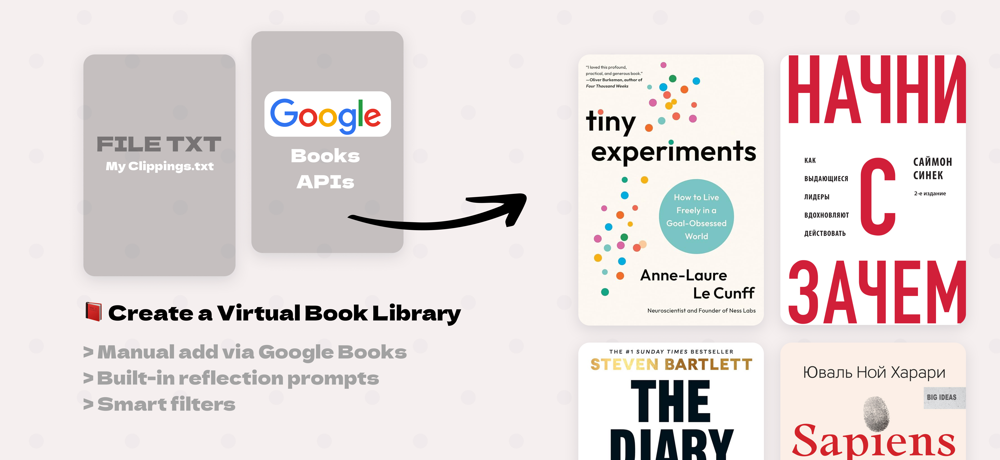
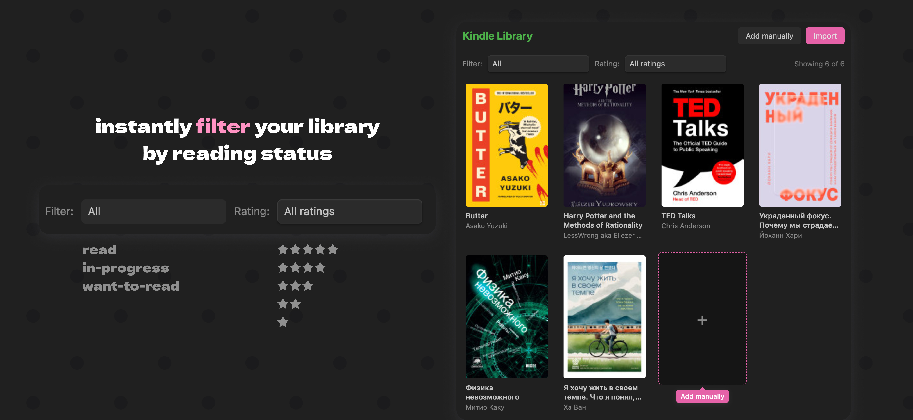
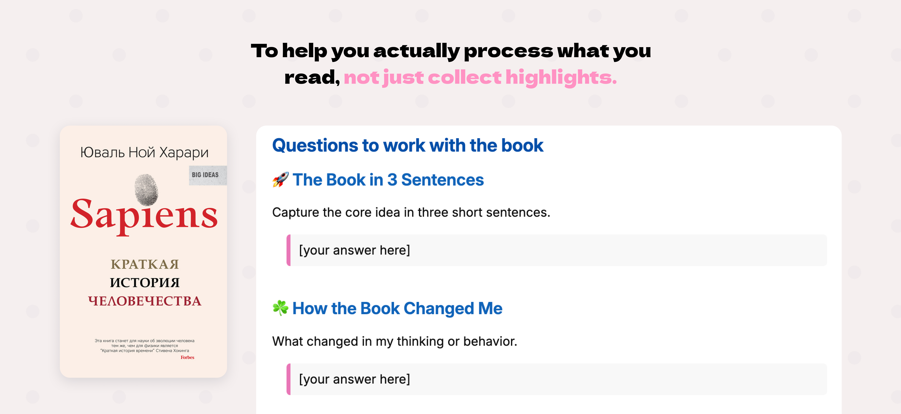

# Kindle Library for Obsidian

> Turn your Kindle highlights into a personal knowledge base — automatically.

---

## The problem

You read on Kindle. You highlight the best passages. Then... nothing happens. Those insights sit locked in `My Clippings.txt`, forgotten.

**Kindle Library** brings everything into Obsidian — with covers, metadata, and reflection prompts — in minutes.

---

## What it does

**📥 Import in one click** — drop your `My Clippings.txt` and the plugin does the rest. It parses every highlight, deduplicates them, and creates a clean note per book.

**🔍 Auto-fetch metadata** — book covers, authors, publishers, descriptions and ISBNs pulled from Google Books automatically.

**➕ Manual add via Google Books** — no clippings yet? Use **Add manually** in the library page and create a book note in seconds.

**📚 Visual library** — browse all your books as a cover grid. See how many you've read at a glance.

**🎯 Smart filters** — instantly filter your library by reading status (`read`, `in-progress`, `want-to-read`) and star rating (`☆☆☆☆☆` → `★★★★★`).

**🗂 Smart duplicate detection** — already imported a book? The plugin knows. It asks if you want to update or skip — never creates accidental duplicates.

**💡 Built-in reflection prompts** — every note starts with 5 questions to help you actually process what you read, not just collect highlights.

**⚙️ Fully customizable** — note template is yours to edit. Change structure, fields, formatting — or reset to default any time.

---

## Quick start

1. Connect your Kindle to your computer
2. Copy `My Clippings.txt` from your Kindle
3. Open Obsidian → click the book icon in the sidebar
4. Hit **Import** and select the file
5. Match each book to Google Books (or add as-is)
6. Or click **Add manually** to add books without `My Clippings.txt`
7. Use status and rating filters to focus on what to read next

That's it. Your library is ready.

---

## Requirements

- Obsidian 0.15+
- Optional: Google Books API key (for higher rate limits)

---

# Kindle Library для Obsidian

> Превратите свои выделения из Kindle в личную базу знаний — автоматически.

---

## Проблема

Вы читаете на Kindle. Выделяете лучшие места. А потом... ничего. Идеи пылятся в файле `My Clippings.txt` и никогда не возвращаются.

**Kindle Library** переносит всё в Obsidian — с обложками, метаданными и вопросами для осмысления — за несколько минут.

---

## Что умеет

**📥 Импорт в один клик** — загрузите `My Clippings.txt`, остальное плагин сделает сам. Разберёт каждое выделение, уберёт дубликаты и создаст отдельную заметку на каждую книгу.

**🔍 Метаданные автоматически** — обложки, авторы, издатели, описания и ISBN подтягиваются из Google Books без лишних действий.

**➕ Ручное добавление через Google Books** — если нет `My Clippings.txt`, нажмите **Добавить вручную** и создайте заметку книги за пару секунд.

**📚 Визуальная библиотека** — все книги в виде сетки обложек. Счётчик прочитанного всегда перед глазами.

**🎯 Умные фильтры** — фильтруйте библиотеку по статусу чтения (`read`, `in-progress`, `want-to-read`) и рейтингу (`☆☆☆☆☆` → `★★★★★`).

**🗂 Защита от дублей** — уже импортировали книгу? Плагин это запомнил. Спросит: обновить или пропустить — никаких случайных дублей.

**💡 Вопросы для работы с книгой** — каждая заметка начинается с 5 вопросов, которые помогают осмыслить прочитанное, а не просто копить цитаты.

**⚙️ Гибкий шаблон** — шаблон заметки полностью настраивается. Меняйте структуру, поля, оформление — или сбросьте к стандарту одной кнопкой.

---

## Быстрый старт

1. Подключите Kindle к компьютеру
2. Скопируйте файл `My Clippings.txt` с устройства
3. Откройте Obsidian → нажмите иконку книги на боковой панели
4. Нажмите **Импорт** и выберите файл
5. Подберите каждую книгу в Google Books (или добавьте как есть)
6. Или нажмите **Добавить вручную**, чтобы добавить книгу без `My Clippings.txt`
7. Используйте фильтры по статусу и рейтингу, чтобы быстро найти нужные книги

Готово. Библиотека собрана.

---

## Требования

- Obsidian 0.15+
- Необязательно: API-ключ Google Books (для снятия лимитов запросов)
